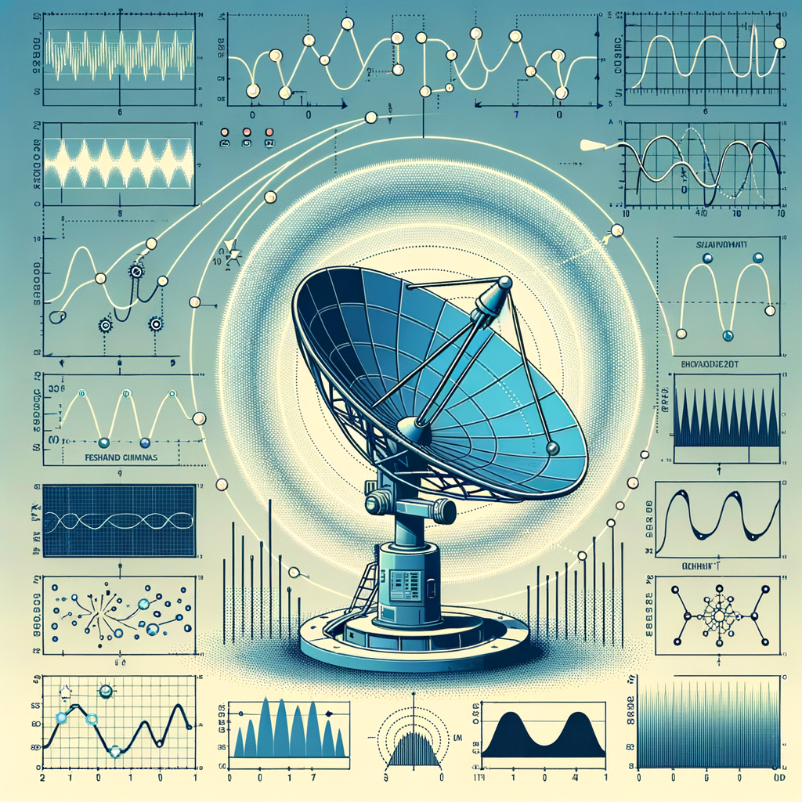

### Intro

ML engineer and researcher with expertise in computer vision, and ML privacy, backed by IEEE/Elsevier/Springer publications and extensive open-source projects. Specializes in vision systems development from 2D detection/tracking to 3D reconstruction. Driven to transform top-tier research into robust, production-ready solutions with real-world impact.

 

  
# ⚠️🚨 My Github Repositories 🚨⚠️

| Category | Platforms | Repositories|
| --- | --- | --- |
| 
 __ML Privacy and Security__    
|          |* [MIA Attacks Implementation](https://github.com/superdianuj/mia_attacks)  * [ambitious explorations over privacy attacks](https://github.com/dianujer/ambitious_explorations_privacyattacks)   * [expolorations over privacy attacks](https://github.com/dianujer/explorations_over_privacyattacks)   * [poisoned output detection](https://github.com/dianujer/poisoned_output_detection)   * [attack on a encrypted model in real space](https://github.com/dianujer/data_driven_attack_encryptedmodel)   * [entropy motivated defenses of Membership Inference Attack](https://github.com/dianujer/entropy_driven_MIA_defenses)    * [information leakage and inference from cache traces](https://github.com/dianujer/cache_trace_analysis)   *  [machine unlearning](https://github.com/dianujer/machine_unlearning)    * [fault in honey encryption](https://github.com/dianujer/faulty_honey_encryption)   * [simple adversarial attack](https://github.com/dianujer/simple_adversarial_attack)   * [simple poisoning attack](https://github.com/dianujer/simple_data_poisoning)   * [literature review progress on secure inference](https://github.com/dianujer/literature_secure_inference_edge)    * [collection of repo links related to ML-privacy](https://github.com/dianujer/ML_privacy_links)|
|  
 __Radar and ECG Signal processing__    
|           | * [radar vital signs project](https://github.com/dianujer/vital_signs_instrument_project)  * [p5 based simulations of radar](https://github.com/dianujer/p5_conceptual_simul_of_radar)  * [comparison of measurement performance between ECG and several Radar based algorithms](https://github.com/dianujer/HR_BR_Radar_ECG)  * [ECG based HR detection methods](https://github.com/dianujer/ECG_HeartRate_Methods)  * [ECG based BR detection methods](https://github.com/dianujer/ECG_BreathingRate_Methods)  * [ECG measurement system](https://github.com/dianujer/ECG_measurement_system)  * [comparison of performance of ECG HR methods](https://github.com/dianujer/ECG_heartrate)  * [comparison of performance of ECG BR methods](https://github.com/dianujer/ECG_BreathingRate)  * [Matlab integration with Sense2Gol radar](https://github.com/dianujer/InfenionSense2Gol_Vital_signs)|
| 
 __Computer Vision__    
|          | * [NeRF variants and Deblurring Models+NeRF on Synthetic-Blurred Datasets](https://github.com/superdianuj/nerf_synthetic_blur)   * [NeRF variants and Deblurring Models+NeRF on Real-Blurred Datasets](https://github.com/superdianuj/nerf_real_blur)  * [BAD-Gaussian and Deblurring Models+GS on Blurred Datasets](https://github.com/superdianuj/gaussian_splt_blur)  * [Unsupervised SAM based 3D point cloud segmentation](https://github.com/superdianuj/SAM_pointcloud_segment)  * [Improved Gaussian Splatting Rendering](https://github.com/superdianuj/imp_gaussian_splatting) * [Improved SuGaR Rendering (Gaussian Splatting)](https://github.com/superdianuj/improved_SuGaR/tree/main)   * [Image Restoration (Denoise & Deblur) (NAFNet)](https://github.com/superdianuj/NAFNet)  * [Image Restoration (Super Resolution) (SPSR)](https://github.com/superdianuj/SPSR)  * [Image Restoration (Deblurring) (HI-Diff)](https://github.com/superdianuj/HI-Diff)  * [Image Restoration (Deblurring) (Diff-PIR)](https://github.com/superdianuj/Diff-PIR) * [diffBIR based Image Restoration](https://github.com/antibloch/DiffBIR) * [Image Restoration (SuperResolution) (Real-ESRGAN)](https://github.com/superdianuj/ESRGAN)  * [Gaussian Talker Ablation Experiments](https://github.com/superdianuj/gaussian_talker_ablation) * [Image Restoration (SuperResolution) (SRCNN and Nina-SR)](https://github.com/superdianuj/super_resolution) * [Gaussian Splatting Exploration](https://github.com/antibloch/gaussian-splatting) * [Open3D-ML Pretrained Inference](https://github.com/antibloch/infer_pc) * [Pair-wise Linkage Point Cloud Segmentation](https://github.com/antibloch/PointCloudSegmentation) * [Rail and Ballast Extraction using Image and Point Processing](https://github.com/antibloch/ballast_extract_pointprocess) * [PointNet Training Comparison](https://github.com/antibloch/pointnet_training_comp) * [Denoising Diffusion Model](https://github.com/antibloch/denoising-diffusion-pytorch) * [Diffusion Model based 3D Point Cloud Segmentation](https://github.com/antibloch/balast_seg) * [LSK3DNet based Point Cloud Segmentation](https://github.com/antibloch/LSK3DNet) * [RandLANet based Point Cloud Segmentation](https://github.com/antibloch/RandLA-Net-pytorch) * [KPRNet based Point Cloud Segmentation](https://github.com/antibloch/kprnet) * [Sphereformer based Point Cloud Segmentation](https://github.com/antibloch/SphereFormer) * [Modified-KPRNet based 2D to 3D point segmentation](https://github.com/antibloch/mod_kprnet)   * [Virtual Try-on from Shopping Sites](https://github.com/superdianuj/shopping_site_tryon)  * [3D Line Detection in LiDAR Point Cloud](https://github.com/superdianuj/LiDAR_Line_Detection)  * [S3DIS PointCloud Segmentation](https://github.com/superdianuj/pointnet_segmentation)  * [3D Plane Detection in LiDAR Point Cloud](https://github.com/superdianuj/LiDAR_Planes_Detection)  * [Image Restoration (Deblur and Super Resolution) (SUPIR)](https://github.com/superdianuj/SUPIR)  * [Fisheye to Equirectangular](https://github.com/superdianuj/fisheye2rectangular)  * [YOLOv11 and Segformer based shirt color detection](https://github.com/antibloch/uniform_color_detect)  * [YOLO Detection and Tracking](https://github.com/superdianuj/yolo_detection_tracking/tree/main)  * [Gaussian Splatting](https://github.com/antidianuj/gaussian_heart)  * [COLMAP Installation](https://github.com/antidianuj/colmap_installation_directs)  * [SIREN Experiments](https://github.com/antidianuj/siren_exps)  * [NVIDIA PeopleNet Detection and Tracking](https://github.com/superdianuj/PeopleNet_Object_Tracking)  * [simplied NeRF architecture comparison](https://github.com/antidianuj/simple_nerf)  * [different Kinds of Image Histogram](https://github.com/superdianuj/img_histo)  * [MRI brain tumor classification and segmentation](https://github.com/dianujizer/tumor_classification_segmentation)  * [experiementation of image processing on MRI slices over U-Net performance](https://github.com/dianujizer/experiment_over_unet) * [brain MRI images condensation](https://github.com/dianujizer/MRI_condensation) * [graph based MRI scan segmentation](https://github.com/dianujizer/Graph_Image_Segment_Implementations)  * [Xception interpretability](https://github.com/dianujer/integrated_gradient_spectrogram_Xception)  * [opencv based violonist assistant](https://github.com/dianujer/violonist_assistant)   * [detectron2 based object detection](https://github.com/dianujer/detectron2_image_objectdetection)  * [my image processing course work](https://github.com/dianujer/image_processing_course_work)  * [edge smoothing](https://github.com/dianujer/binary_edge_smoother)  * [spectrogram based urban sound classification](https://github.com/dianujer/urban_sound_alexent_architecture_classification)  * [Autoencoder denoising](https://github.com/dianujer/mnist_denoising_autoencoder) |
|
 __Natural Language Processing__    
|         | * [LLM finetuning](https://github.com/antibloch/llm_finetuning)  * [ML Literature Research Agent](https://github.com/antibloch/ml_reviewer)  * [text-signal driven classification](https://github.com/superdianuj/text_signal_classification)  * [text summarization](https://github.com/dianujer/text_summarization)   * [textual toxicity ranking](https://github.com/dianujer/toxity_ranker)  * [sentiment classification via BERT](https://github.com/dianujer/Bert_sentiment_classification)  * [plagarism remover](https://github.com/dianujer/Gingerit_Plagarism_Remover)  * [BERT based grammatical correction classification](https://github.com/dianujer/BERT_CoLA)  * [sentence Modelling using Matrix Factorization and RNN](https://github.com/dianujer/Text_Modelling_NMF_Text_Classification_RNN)  * [finding candidate journal from large bibtex file](https://github.com/dianujer/journal_finder)|
|
 __Chemical Sequence Analysis__    
|             | * [protein-protein interaction Classification](https://github.com/dianujer/protein_sequence_classification)  * [SMILE string classification](https://github.com/dianujizer/SMILES_classification)|
|
 __Brain Connectivity Analysis__     
 |           | * [SSA implementations](https://github.com/dianujer/SSA_implementations)  * [EEG visualization](https://github.com/dianujer/mne_EEG_visual)  * [GAN based Structural Connecitivty data variations](https://github.com/dianujer/Structural_connectivity_network_GAN)|
| 
__Accelerometer and ML__    
|            | * [sparsity based accelerometer spectrogram classification](https://github.com/dianujer/sparse_learning_novice_pro_accelerometer_classification)  * [simple compressed sensing](https://github.com/dianujer/simple_Compressed_Sensing)  * [spectrogram based human activity recognition](https://github.com/dianujer/human_activity_estimation)  * [gym Trainee accelerometer dataset under different workouts](https://github.com/dianujer/Gym_trainee_activity_dataset)  * [measuring training capacity of gym trainees using AlexNet and spectrograms](https://github.com/dianujer/Trainee-traniner_deep_learning-part2)  * [estimating moods of gym trainees and counting reps using accelerometer spectrograms](https://github.com/dianujer/Trainee-traniner_deep_learning-part1)|
| 
__COVID-19 and ML__    
|            | * [compartment model identification using SINDy](https://github.com/dianujer/comparment_model_identification)  * [Attention based SIQRD parameter estimation and Data driven policy determination for control of infection spread](https://github.com/dianujer/attention_siqrd)  * [Image processing, Mathematical modelling and NLP based gathering insights from COVID-19 literature](https://github.com/dianujer/Covid_review)  * [collect daily COVID-19 statistics in Korea using API](https://github.com/dianujer/COVID_19_SKorea_daily_csv_storage)  * [COVID-19 symptom severity classification](https://github.com/dianujer/covid19_syptom_sverity_classification)  * [Simulations of hypothetical SEQIHRD model](https://github.com/dianujer/SEQHIRD_progress)  * [Simulations of hypothetical SVEQIHRD model](https://github.com/dianujer/sveqihrd)|
| 
__Interferometry and ML__    
|         | * [self-mixing interferometry displacement parameter estimation](https://github.com/dianujizer/SMI_amplitude_esim)   * [deep learning estimation of amplitude and frequency of target from self-interferometric signal](https://github.com/dianujer/SMI_amplitude_esim)
| 
 __Miscallaneous ML__    
|           | * [music genre classification using CNN-LSTM](https://github.com/dianujer/music_genre_cnn_lstm)  * [comparison of simple and Q-learning based link prediction in graphs](https://github.com/dianujer/simple_and_q_based_reinforcement_learn_links_in_graphs)    * [actor-critic based stocks trader](https://github.com/dianujer/Actor_Critic_basedStock_trader)   * [Probabalistic neural network using KNIME](https://github.com/dianujer/Probabalistic_NN_KNIME)  * [sales forecasting using deepXF](https://github.com/dianujer/deepXF_sales_forecast)  * [forecasting via extreme learning](https://github.com/dianujer/extreme_learning_covid_forecasting)  * [breast cancer classification using random forecast](https://github.com/dianujer/Cancer_classify_random_forest)  * [MATLAB breast cancer classification](https://github.com/dianujer/breast_cancer_classification_matlab)   * [drug prescriber deployment on Azure](https://github.com/dianujer/flask_Azure_drug_precriber)   * [Autoencoder LSTM based power consumption forecasting](https://github.com/dianujer/autoencoder_lstm)   * [LSTM based bitcoin price forecasting](https://github.com/dianujer/LSTM_bitcoin_price_forecasting)|
| 
 __App and Web Developement__    
|            | * [contact tracing flutter app-version 1](https://github.com/dianujer/AppCOVIDv1)   * [contact tracing flutter app-version 2](https://github.com/dianujer/AppV2.3)   * [contact tracing flutter app-version final](https://github.com/dianujer/covidproject_app_final)   * [Node.js web app](https://github.com/superdianuj/CovidTrackerApp-Web_simple_GUI_login_register_send_emails)  * [basic HTML-CSS page workout](https://github.com/dianujer/basic_html_css_page)   * [Android Kotlin project for visualization COVID-19 statistics via API](https://github.com/dianujer/covid_cases_tracker_US)   * [Android Java project to access and display sensor values](https://github.com/dianujer/sensor_data_view_android)   * [Nodejs based twitter follower hiearchy](https://github.com/dianujer/nodejs_twitter_follower_hiearchy)   * [flutter based directed graph construction of a person contact with different places](https://github.com/dianujer/create_flowchart)   * [time-otp based flutter project]()   * [streamlit based login/signup page](https://github.com/dianujer/streamlit_login_signup_verify)   * [nodejs based anonymization of csv containing GPS data](https://github.com/dianujer/nodejscsv_gps_perturbation)   * [flutter project to store texts in local storage while in background on Android](https://github.com/dianujer/background_android_local_text_storage)   * [nodejs api for converting coordinates to distance](https://github.com/dianujer/nodejsapi_coordinate_2_distance)   * [nodejs and mongdb based login/signup api that can send emails to db contacts](https://github.com/dianujer/nodejs_mongodb_login_signup_sendEmail)   * [flutter app that collects gps data and stores it in HiveDB, and it can upload the db data as csv file to a rest api](https://github.com/dianujer/hivedb_gps_collection_csv_uploading)   * [android project for login/signup page](https://github.com/dianujer/login-signup_gui_android)   * [flutter project that can perform all login/signup tasks and also has qr scan functionality](https://github.com/dianujer/login_signup_password_reset_otp_qr_scan_gui)   * [nodejs based csv manipulation](https://github.com/dianujer/csv_manipulation_nodejs)   * [reference html frontends](https://github.com/dianujer/html_frontend)  * [flutter project that can generate and store data in csv, in background, and can also produce notifications](https://github.com/dianujer/background_csv_gen_notification)   * [flutter app that stores data in hive db](https://github.com/dianujer/hive_extrapolation)  * [flutter project for storing data in hivedb in anonymized manner(encrypted)](https://github.com/dianujer/gps_data_storing_anonymized_fast)  * [flutter becaon transmitter and reciever](https://github.com/dianujer/Junaid_second_ref_bt_transmitter_reciever)  * [flutter transmit beacon in background](https://github.com/dianujer/bt_transmitter_background)  * [flutter based rolling BT beacon ID transmission](https://github.com/dianujer/BT_mode2_minusValidation)  * [flutter project for working with CSV](https://github.com/dianujer/reference_csv_gen)   * [flutter project that transmits and recieves BT UUID and stores them in CSV](https://github.com/dianujer/BT_transmitter_reciever_anonymized_csv)|
